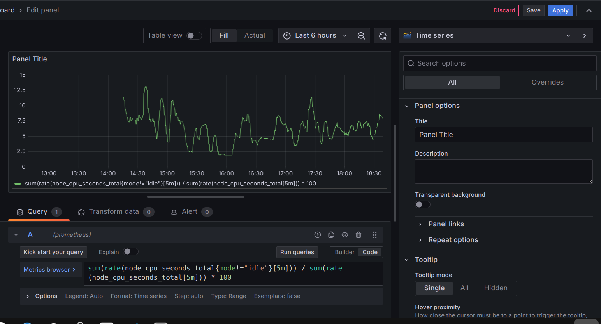
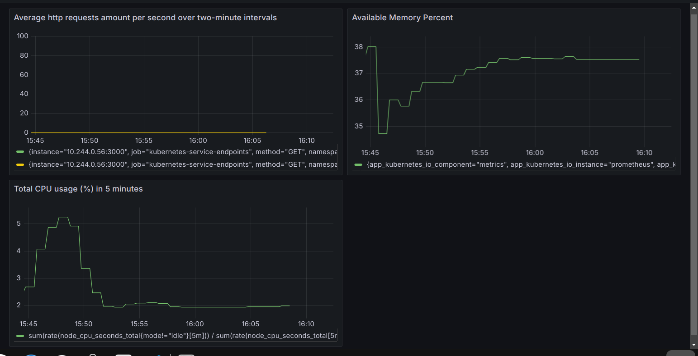
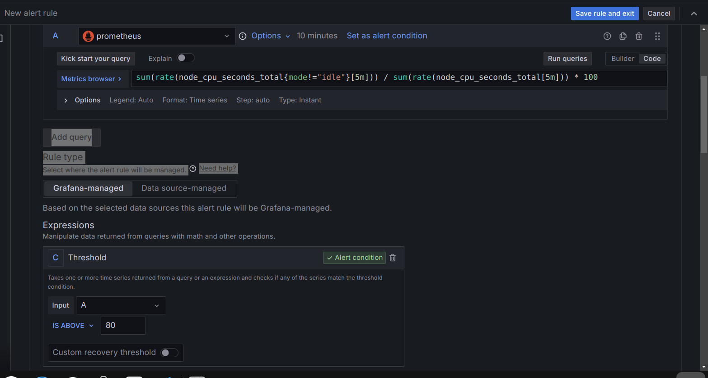
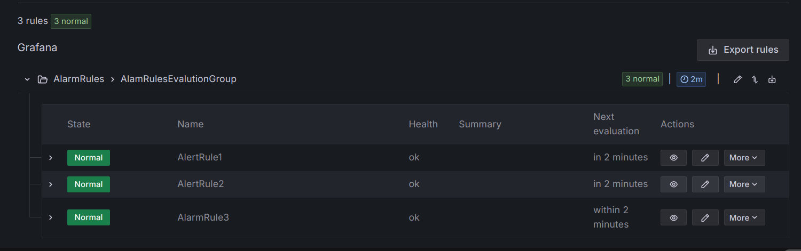

Fırat Dede
dede.firat.dede@gmail.com
# Vodafone Devops Bootcamp Final Task Çözümü
Bu README.md dosyası Vodafone Devops Bootcamp Final Taskın çözümünü anlatmak için oluşturdum. Bu taskın çözümünde kullandığım dosyaları şu adresteki <https://github.com/FiratDede/Vodafone-Devops-Bootcamp-Final-Task> __Vodafone-Devops-Bootcamp-Final-Task__ __Github__ reposunda bulabilirsiniz. Ben bilgisayarımda __Ubuntu 22.04 Desktop__ Linux dağıtımını kullanıyorum. Şimdi bu ödevi yapmak için sırasıyla uyguladığım adımları yazmak istiyorum.

## Github Reposu Oluşturmak
Bu ödevdeki kodları remote bir repoda tutmak için bir adet __Github__ reposu oluşturdum. __Github__ hesabıma giriş yapıp,  __public__ __Vodafone-Devops-Bootcamp-Final-Task__ adında bir __Github__ reposu oluşturdum. Bu repoya bu ödevi yaparken neyi nasıl yaptığımı anlatmak için bir adet "README.md" dosyası ekledim. Bu repoya <https://github.com/FiratDede/Vodafone-Devops-Bootcamp-Final-Task>  linkinden ulaşabilirsiniz.
## Github Reposunu Locale Yüklemek
Bu github reposunu kendi local bilgisayarıma çekmek ve daha sonr bu repoyu kendi local bilgisayarımdan güncellemek için aşağıdaki komutu terminalde çalıştırıyorum.
`git clone https://github.com/FiratDede/Vodafone-Devops-Bootcamp-Final-Task`
Şimdi github reposunu yerelime indirdim. Vscode kullanarak bu reponun içine girip değişiklikler yapıcam. 

## Nodejs Web Sunucusu Oluşturmak
Ödevin ilk kısmında benden basit bir web uygulaması yaratmamı istiyordu. Ben basit bir Nodejs express sunucusu yaratmayı tercih ettim. Bu web sunucusu ile ilgili dosyaları __nodejs-server__ adındaki bir klasörün içinde depolamak istiyorum. __nodejs-server__ klasörünü yereldeki git repomda oluşturduktan sonra, şimdi web sunucumu implement etmek için gerekli dosyalarımı oluşturacağım.  Bunun için öncelikle bir __npm__ paketi yaratmalıyım. __npm__ paketi yaratmak için aşağıdaki komutu çalıştırdım.
`npm init`
Gerekli bilgileri girdikten sonra bir adet __npm__ paketi yaratmış oldum. 
Şimdi bu web sunucusunu yaratmak, test etmek ve onun prometheus tarafından metriclerinin toplanması için bazı paketleri indirmemiz gerekiyor:
* Express sunucusunu oluşturmak için aşağıdaki komutu kullanarak __express__ paketini indiriyoruz.
`npm install express` 
* Express sunucumuza test yazıp, test etmek için aşağıdaki komutu çalıştırarak __mocha__, __chai__ ve __supertest__ paketlerini indiriyorum.
`npm install --save-dev mocha chai@4.4.1 supertest`
* Express sunucumuz ile ilgili metriklerin prometheus tarafından toplanması için __express-prometheus-middleware__ paketini indirmemiz gerekiyor. Bunun için aşağıdaki komutu çalıştırıyorum.
`npm install express-prometheus-middleware`

Şimdi web sunucumu implement etmek için __app.js__ adında bir dosya oluşturup, bu dosyanın içine aşağıdaki içeriği yazdım:
```javascript
const express = require('express')
const app = express()
const promMid = require('express-prometheus-middleware');
const port = 3000

app.use(promMid({
    metricsPath: '/metrics',
    collectDefaultMetrics: true,
    requestDurationBuckets: [0.1, 0.5, 1, 1.5],
    requestLengthBuckets: [512, 1024, 5120, 10240, 51200, 102400],
    responseLengthBuckets: [512, 1024, 5120, 10240, 51200, 102400],
    

}))

app.get('/', (req, res) => {
    res.send('Vodafone Devops Bootcamp!')
})

app.listen(port, () => {
    console.log(`Server is listening on port ${port}`)
})

module.exports = app

```
Yukarıdaki kod bizim 3000 portunda çalışan bir node express sunucusu oluşturmamıza olanak sağlıyor. Bu sunucunun şu an bir adet çalışan route'u var, o da kök route'ı ("/"). Ve kullanıcı bu kök route'a eriştiğinde ekranda '__Vodafone Devops Bootcamp!__' yazısı çıkıyor. "app.use(promMid..." ile başlayan kısmı, express sunucumuzu prometheusa entegre etmek, ve express uygulamamız ile ilgili bazı metrikleri toplamak için yazdık.

Şimdi uygulamamızı test etmek için basit bir test case'i yazacağız. Bunun için test adında bir klasör oluşturup, bu klasörün içinde __test.js__ adında bir js dosyası oluşturuyorum. __test.js__ dosyasının içeriği aşağıdaki gibidir
```javascript
const request = require('supertest');
const chai = require('chai');
const app = require('../app');

const expect = chai.expect;

describe('GET /', () => {
  it('should return Vodafone Devops Bootcamp!', (done) => {
    request(app)
      .get('/')
      .end((err, res) => {
        expect(res.status).to.equal(200);
        expect(res.text).to.equal('Vodafone Devops Bootcamp!');
        done();
      });
  });
});
```
Yukarıdaki kod express sunucumuzun root ("/") route'ına bir adet HTTP isteği gönderiyor. Ve sunucudan aldığı cevaba göre bir test yapıyor. Eğer ki cevap, 200 status kodu ile dönerse ve cevabın içeriği __Vodafone Devops Bootcamp!__ yazısına eşit ise test başarılı olur. Eğer bu şartları sağlamıyorsa test başarısız olur. Bu arada bu testi çalıştırmak için `mocha exit` komutunu çalıştırmalıyım. Bunun için __package.json__ daki scripts kısmına aşağıdaki satırı ekledim.
`"test": "mocha --exit"`
Yukarıdaki satir sayesinde artık terminalde `npm run test` yazıldığında `mocha exit` komutu çalışacak.

Şimdi aşağıdaki komutları çalıştırarak bu local repoyu commitleyip, remote Github reposuna pushlayabiliriz.
```
git add .
git commit -m <message>
git push
```
message kısmına istediğimiz commit mesajını yazabiliriz.
## Docker'ı Bilgisayarıma Yüklemek
Şimdi __Docker__ teknolojisini bilgisayarıma yüklemem gerekiyor. Bunun için __Docker__ 'ın resmi sitesine girip, __Docker__ 'ı bilgisayarıma nasıl kuracağımı öğreniyorum. Bana aşağıdaki komutları çalıştırırsam __Docker__'ı bilgisayarıma kuracağımı söylüyor.
```bash
# Add Docker's official GPG key:
sudo apt-get update
sudo apt-get install ca-certificates curl
sudo install -m 0755 -d /etc/apt/keyrings
sudo curl -fsSL https://download.docker.com/linux/ubuntu/gpg -o /etc/apt/keyrings/docker.asc
sudo chmod a+r /etc/apt/keyrings/docker.asc

# Add the repository to Apt sources:
echo \
"deb [arch=$(dpkg --print-architecture) signed-by=/etc/apt/keyrings/docker.asc] https://download.docker.com/linux/ubuntu \
$(. /etc/os-release && echo "$VERSION_CODENAME") stable" | \
sudo tee /etc/apt/sources.list.d/docker.list > /dev/null
sudo apt-get update

sudo apt-get install docker-ce docker-ce-cli containerd.io docker-buildx-plugin docker-compose-plugin

```
Yukarıdaki komutları çalıştırdıktan sonra __Docker__ 'ı bilgisayarıma kurmuş bulunuyorum. Fakat docker ile alakalı komutları çalıştırmam için __root__ yetkisi gerekiyor bundan dolayı __Docker__ ile alakalı komutları her kullanmak istediğimde başına __sudo__ yazmam gerekiyor. Ben bunu istemediğim için  aşağıdaki komutu çalıştırıyorum.
`sudo usermod -aG docker $USER`
Yukarıdaki komut şu anki kullanıcımı docker grubuna ekliyor, bu sayede başında sudo kullanmadan docker komutlarını çalıştırabiliyorum.
## Nodejs Uygulamasını Docker Kullanarak Konteynirize Etmek
Şimdi Nodejs uygulamamızı __Docker__ kullanarak konteynirize edelim. Bunun için öncelikle bir adet __Dockerfile__ oluşturmamız gerekiyor. Ben aşağıdaki __Dockerfile__ 'ı oluşturdum:
```dockerfile
FROM node:16.17.0 as base
 
WORKDIR /nodejs-server
 
COPY package.json package.json
COPY package-lock.json package-lock.json

RUN npm install
 
COPY . .

RUN npm run test

CMD [ "node", "app.js" ]
``` 
Yukarıdaki __Dockerfile__ sayesinde nodejs sunucumu içeren bir adet __Docker__ image'i oluşturabilirim. Tek tek bu dockerfile daki satırları açıklamak istersek:
* `FROM node:16.17.0 as base` satırı ile Nodejs 16.17.0 sürümünü içeren offical bir Node.js Docker imajını baz alarak Docker imageimi oluşturuyorum. Bu imagın içinde __nodejs__ , __npm__ gibi yazılımlar var.
* `WORKDIR /nodejs-server` komutu konteyner içinde __/nodejs-server__ adlı bir dizin oluşturup, şu an bu dizin içinde çalışacağımı söylüyorum
* `COPY package.json package.json` ve `COPY package-lock.json package-lock.json` satırları ile hostumuzdaki "package.json" ve "package-lock.json" dosyalarımızı docker imageımıza kopyalıyoruz. Aslında bu 2 satır yerine direk aşağıdaki `COPY . . `satırını da kullanabilirdik, fakat bu bir best practicedir. Eğer ki bu ikisi yerine `COPY . .` yazsaydık o zaman herhangi bir dosya değiştikten sonra tekrar build aldığımızda tüm katmanları tekrar yükleyecekti, bundan dolayı `npm install`  ile bağımlılıklarıda sıfırdan tekrar yükleyecekti. Ve bu uzun build sürelerine sebep olacaktı. Fakat `COPY package.json package.json` ve `COPY package-lock.json package-lock.json` satırları sayesinde eğer ki sonraki buildimizde "package.json" ve "package-lock.json" dosyalarında bir değişiklik olmassa, `npm install` komutu paketleri tekrar yüklemicek ve buda build süresini baya azaltıcak.
* `RUN npm install` satırı ile nodejs express uygulamamız için gerekli paketleri containerımıza yüklüyoruz.
* `COPY . .` satırı ile hosttaki buildi başlatıcağımız dizindeki tüm dosyaları (.dockerignore da bulunanlar hariç) docker imageına kopyalıyoruz.
* `RUN npm run test` bu komut express uygulamamızın testlerini çalıştırıyor, eğer ki testler başarısız olursa build başarısız olur.
* `CMD [ "node", "app.js" ]` satırı ise container çalıştığında çalışacak argumentsleri yazıyor, yani container ayağa kalktığında bizim express sunucumuzu runlanıcak.

Şimdi artık docker imageimizi oluşturabiliriz. Docker imageimizi build etmek için "nodejs-server" dizininin içinde aşağıdaki komutu çalıştırıyorum.
`docker build -t firatdede/nodejs-server .`
Yukarıdaki komut çalıştıktan sonra artık localimde __firatdede/nodejs-server:latest__ adında bir docker image yaratılmış oluyor.
Şimdi bu docker imageini runlayıp containeri çalıştırmak için aşağıdaki komutu kullanıyorum.
`docker run -d -p 3000:3000 firatdede/nodejs-server`
Yukarıdaki komut sayesinde image'imizi çalıştırıp konteynırımızı ayağa kaldırdık. Yukarıdaki komut __firatdede/nodejs-server:latest__ isimli image'i çalıştırıp, kontainerdaki __3000__ portundaki uygulamayı bizim local hostumuzdaki __3000__ portuna bind eder. Bu sayede __3000__ portunu kullanarak hostumuzdan, containerdaki uygulama ile etkileşime geçebiliriz.
Şimdi containerımızın beklediğimiz gibi çalışıp çalışmadığını test etmek için, browserımızı açıyoruz. Ve adres kısmına [localhost:3000](http://localhost:3000/) yazıyoruz. Ve ekranda  __Vodafone Devops Bootcamp!__ yazısını görüyorum demekki container düzgün çalışıyor.

## Kubectl ve Minikube Yüklemek
Şimdi ödevin kubernetes deployment kısmına geldim. Kubernetes deploymentı için __minikube__ 'i bilgisayarıma indirmem gerekiyor. Bunun içinde önce __kubectl__ i bilgisayarıma kurmam gerekiyor. __kubectl__ kubernetes clusterlarını yönetmemi sağlayan bir çeşit cli tool. __kubectl__ sayesinde deploymentlar veya servisler yaratabilirim.
__kubectl__ i indirebilmek için __Kubernetes__'in sitesine gidiyorum. Ve __kubectl__ 'i indirmek için gereken komutları öğreniyorum:
```bash 
curl -LO "https://dl.k8s.io/release/$(curl -L -s https://dl.k8s.io/release/stable.txt)/bin/linux/amd64/kubectl"
sudo install -o root -g root -m 0755 kubectl /usr/local/bin/kubectl
``` 
Yukarıdaki komutları çalıştırdıktan sonra __kubectl__'i başarıyla indirip indirmediğimi test etmek için aşağıdaki komutu çalıştırdım.
`kubectl version --client`
Ve outputa bakarak başarıyla indirdiğimi gördüm. 
Şimdi __minikube__'i indireceğim.
Bunun için __minikube__'ın sitesine gidiyorum. Ve bana __minikube__ 'i yüklemem için aşağıdaki komutları çalıştırmamı söylüyor.
```bash
curl -LO https://storage.googleapis.com/minikube/releases/latest/minikube-linux-amd64
sudo install minikube-linux-amd64 /usr/local/bin/minikube && rm minikube-linux-amd64
```
Yukaridaki komutları runladıktan sonra __minikube__ 'ı  başlatmak için aşağıdaki komutu çalıştırıyorum.
`minikube start`
__minikube__ 'ı çalıştırdıktan sonra şimdi nodejs uygulamamızı minikube clustera deploy etmek ve dışardan erişimini sağlamak için gerekli yaml file'ı oluşturabiliriz.
## Nodejs Serverinı Minikube'e Deploylamak ve Dışardan Erişilebilir Yapmak
Şimdi nodejs serverinı Minikube'e deploylamak ve dışardan erişilebilir hale getirmek için bir adet Kubernetes Deployment ve bir adet Kubernetes Service componenti oluşturmalıyız. Bu componentleri oluşturmak için __nodejs-server-deployment-service.yaml__ adında ve içeriği aşağıdaki gibi olan bir dosya oluşturuyorum:
```yaml
apiVersion: apps/v1
kind: Deployment
metadata:
  name: nodejs-server-deployment
  labels:
    app: nodejs-server
spec:
  replicas: 1
  selector:
    matchLabels:
      app: nodejs-server
  template:
    metadata:
      labels:
        app: nodejs-server
    spec:
      containers:
      - name: nodejs-server
        image: firatdede/nodejs-server
        ports:
        - containerPort: 3000
---
apiVersion: v1
kind: Service
metadata:
  name: nodejs-server-service
  annotations:
    prometheus.io/scrape: "true"
spec:
  selector:
    app: nodejs-server
  ports:
    - protocol: TCP
      port: 3000
      targetPort: 3000
      nodePort: 30000
  type: NodePort

```
Yukarıdaki yaml file'ı açıklamak istersen, deploy edilecek __image__ kısmına daha önce build ettiğimi __firatdede/nodejs-server__ kısmını verdim. Yine bu uygulama "- containerPort: 3000" kısımı sayesinde konteynırın içinde __3000__ portunda çalışacak.  Servis tipi olarak __NodePort__ u seçtim, bu sayede minikube nodeu üzerinde __30000__ portunda dışarıya açık bir servis açılacak, ve ben bilgisayarımdan bu servisi kullanarak uygulamama erişebileceğim. Bu arada servisin annotations kısmına `prometheus.io/scrape: "true"` satırını eklememin sebebi promethusun bu servisi kullanarak nodejs uygulamamın metriklerini toplamasını sağlamak.

Şimdi bu Deployment ve Service componentlerini minikube clusterımda oluşturmak için aşağıdaki komutu yazıyorum.
`kubectl apply -f nodejs-server-deployment-service.yaml`
Bu işlemleri yaptıktan sonra nodejs uygulamama dışarıdan erişip, erişemediğimi test etmem için şu formattaki adrese `http://<NodeIp>:NodePort` bir HTTP isteği atmak istiyorum. Öncelikle __minikube__ clusterımda bulunan nodeun IP sini bulmam lazım. Bunun için aşağıdaki komutu çalıştırıyorum.
`minikube ip`
Ve çıkan outputa bakarak nodeumun ipsini __192.168.58.2__ olarak buluyorum. Şimdi browser ımı açıp __http://192.168.58.2:30000/__ adresine istek atıyorum. Ve ekranda '__Vodafone Devops Bootcamp!__' yazısı çıkıyor. Yani servisime dışarıdan erişebildim.
## Jenkinsi Local Makineye Yüklemek
Şimdi Jenkinsi local makineme kurmam gerekiyor. Bunun için öncelikle Javayı indirmem gerekiyor fakat benim bilgisayarımda Java zaten kurulu olduğu için indirmememe gerek yok. Şimdi Jenkinsi local makineme indirmek için  "https://www.jenkins.io/doc/book/installing/linux/#debianubuntu" adresine gidiyorum.Ve bu adresten Jenkinsi yüklemem için gerekli olan, aşağıdaki komutları alıyorum.
```bash
sudo wget -O /usr/share/keyrings/jenkins-keyring.asc \
  https://pkg.jenkins.io/debian-stable/jenkins.io-2023.key
echo "deb [signed-by=/usr/share/keyrings/jenkins-keyring.asc]" \
  https://pkg.jenkins.io/debian-stable binary/ | sudo tee \
  /etc/apt/sources.list.d/jenkins.list > /dev/null
sudo apt-get update
sudo apt-get install jenkins
```
* Yukarıdaki komutları başarıyla çalıştırdıktan sonra artık Jenkinsi local makineme yüklemiş oldum.
## Jenkins Servisine Login Olmak
Şimdi Jenkinsi indirdik, fakat daha Jenkinsin arayüzüne login olmadık. Jenkins servisi default olarak 8080 portunda hizmet vermektedir. Bu hizmete erişmek için browserımı açıp adres kısmına __http://localhost:8080/__ yazıp entera basıyorum. Şimdi Jenkinsi ilk kurduğum için benden bir şifre istiyor, ve bu şifrenin bulunduğu dosyanın pathini bana söylüyor. Bu şifrenin bulunduğu dosyayı okumak için aşağıdaki komutu çalıştırıyorum.
`sudo cat /var/lib/jenkins/secrets/initialAdminPassword`
Şifreyi gördükten sonra browserdan şifre kısmına yazıyorum. Daha sonra bana hangi Jenkins pluginlerini yüklemek istediğimi soruyor. Burada ben önerilen Jenkins pluginlerini tercih ediyorum. Bu eklentiler yüklendikten sonra bana bir admin kullanıcısı yaratmamı söylüyor. Ve ben bir admin kullanıcısı yaratmak için kullanıcı adı, şifre ve diğer bazı bilgileri girip bu admin kullanıcısını oluşturuyorum. Bu kullanıcı adı ve şifre bilgisi ile admin kullanıcısına login yapıcaz bundan dolayı bu bilgileri unutmamalıyız.
## Jenkinste CI/CD Pipeline ı Yaratmak
Şimdi (login) yaptıktan sonra bir adet pipeline oluşturmam lazım. Bunun için soldan "New Item" yazan yere tıklayorum. Benden bir item adı istiyo, item adı olarak __vodafone-devops-bootcamp-final-task-pipe__ yazdım. Pipeline oluşturmak için "Pipeline"'ı seçip  "OK" tuşuna bastım.
Şimdi önüme pipeline ile ilgili ayarlar geldi. Burdan __Pipeline__ bölümünden __Pipeline Script From SCM__ kısmını seçiyorum. Bu sayede pipelini scriptini bir __SCM__ yardımıyla  github reposundan çekip, çalıştıracak. Daha sonra benden kullanacağı __SCM__ yi __Repo URL__'ini, __repo branch__ ini, ve pipeline scriptinin pathini istiyor. Bu değerlere sırasıyla __git__, https://github.com/FiratDede/Vodafone-Devops-Bootcamp-Final-Task/, __*/main__  ve __Jenkinsfile__ yazdım.
## Jenkinsfile Yaratmak
Şimdi sırada pipeline scriptini yaratmak var. Localdeki github repomun içinde aşağıdaki içeriğe sahip __Jenkinsfile__ 'ı yaratıyorum:
```
pipeline {
    agent any
    stages {
        stage('Test And Build') {
            steps{
                dir('nodejs-server'){
                    // Test operation done in Dockerfile while building docker image. Check Dockerfile
                    sh "docker build -t firatdede/nodejs-server:latest ."
                }  
            }
        }
        stage('Push Image') {
            steps{ 
                withDockerRegistry(credentialsId: 'docker_hub_credentials', url: 'https://index.docker.io/v1/') {
                    sh "docker push firatdede/nodejs-server:latest" 
                }
            }
        }
        stage('Deploy') {
            steps{
                dir('nodejs-server'){
                    sh "kubectl apply -f nodejs-server-deployment-service.yaml"
                }   
             }
        }
    }
}
```
Şimdi yukarıdaki pipeline scripti açıklamak istersek. Bu pipeline 3 stageden oluşuyor. Şimdi bu stageleri tek tek açıklayalım:
* __Test And Build__ stage'inde nodejs uygulamamızı build ederek bir Docker imagei oluşturuyoruz. Bu arada bu kısımda nodejs uygulamamızın testlerini de docker imageini build ederken yapıyoruz. Eğer ki testler başarısız olursa build başarısız oluyor. Bu adım başarıyla tamamlandıktan sonra localimizde __firatdede/nodejs-server:latest__ adında bir docker image oluşmuş oluyor.
* __Push Image__ stage'inde ise oluşturduğumuz image'i Dockerhub registry sine push ediyorum. Bu sayede internet üzerinden bu image i localime çekebilirim. Bu kısım için öncelikle Jenkins arayüzünü kullanarak idsi 'docker_hub_credentials' olan bir credentials yarattım. Bu credentials benim docker hub personal access tokenimi içeriyor. Bu sayede dockerhubtaki repoma image'imi pushlayabiliyorum.
* __Deploy__ stage'inde ise oluşturduğumuz bu nodejs uygulamasını minikube clusterına deploy ediyoruz. Fakat burda çok önemli bir kısım var.
  > *__Önemli__*: Jenkins ile build alıp, pipeline scripti çalıştırdığımız zaman, bu script  __jenkins__ kullanıcısı tarafından çalıştırılır. Fakat biz __minikube__ 'i başka bir kullanıcı ile çalıştırmıştık. Jenkinsin bizim çalıştırdığımız __minikube__ 'ı tanıması için öncelikle __config__ dosyasını jenkinsin bulunduğu pathe taşıyıp ardından, bu jenkins kullanıcısına sahiplik vererek bu dosyaya okuma ve yazma yetkisi vermemiz gerekiyor. Onun için aşağıdaki komutları çalıştırmalıyız.
  ```bash
  sudo mkdir -p /var/lib/jenkins/.kube
  sudo cp $HOME/.kube/config /var/lib/jenkins/.kube/config
  sudo chown -R jenkins:jenkins /var/lib/jenkins/.kube
  ```
  Öncelikle jenkinsin  içinde __.kube__ dizinini oluşturmalıyım.Sonra config dosyası benim kullanıcımda __$HOME/.kube/config__ pathinde yer alıyor, bu dosyayı __/var/lib/jenkins/.kube/__ dizinine kopyalıyorum ve sonrada recursive bir şekilde .kube dizini ve içindeki dosyalara jenkins kullanıcı ve jenkins grubu sahipliği veriyorum.

## Helm Yüklemek
Şimdi __Prometheus__ ve __Grafanayı__ minikube clusterıma kolaylıkla deploy edebilmek için helmi bilgisayarıma kurmak istiyorum. Bunun için aşağıdaki komutları çalıştırıyorum.
```bash
curl https://baltocdn.com/helm/signing.asc | gpg --dearmor | sudo tee /usr/share/keyrings/helm.gpg > /dev/null
sudo apt-get install apt-transport-https --yes
echo "deb [arch=$(dpkg --print-architecture) signed-by=/usr/share/keyrings/helm.gpg] https://baltocdn.com/helm/stable/debian/ all main" | sudo tee /etc/apt/sources.list.d/helm-stable-debian.list
sudo apt-get update
sudo apt-get install helm
```
## Prometheus ve Grafanayı Helm Kullanarak Minikube Clustera Deploy Etmek
Şimdi helmi local pcmize yükledik. Şimdi helmi kullanarak __Prometheus__ ve __Grafana__'yı minikube clusterımıza deploy edeceğiz. Bunun için şu siteye "https://artifacthub.io/" gidiyoruz. Bu siteyi kullanarak istediğimiz helm chartı hakkında bilgi alabiliyoruz. Burdan önce prometheus'un helm chartları hakkında bilgi alıyoruz. Ve __values-prometheus.yaml__  ını indiriyoruz. Bunu yaml dosyası içindeki bazı değerleri değiştirmek istiyorum böylece  prometheus istediğim ayarlarda minikube clusterımda çalışacak. Ben sadece bu dosyanın içinde aşağıdaki kısımları değiştirdim.
```yaml
...
    loadBalancerIP: ""
    loadBalancerSourceRanges: []
    servicePort: 80
    nodePort: 30001 # Sonradan ekledim
    sessionAffinity: None
    type: NodePort # Sonradan ekledim
...
...
```
Yukarıdaki yaml dosyasındaki servis kısmındaki ayarlardan servis tipini __NodePort__  nodePort kısmınıda __30001__ olarak değiştirdim. Bu sayede prometheus sunucusuna minikube nodeunun __30001__ portundan erişebilirim.
Şimdi __Prometheus__ reposunu eklemek için aşağıdaki komutları çalıştırıyorum.
``` bash
helm repo add prometheus-community https://prometheus-community.github.io/helm-charts
helm repo update
```
Şimdi promethues chartını kendi values-prometheus.yaml dosyasını baz alarak indirmek için aşağıdaki komutu çalıştırıyorum.
```bash
helm install prometheus prometheus-community/prometheus -f values-prometheus.yaml
```
Bu komutları çalıştırdıktan sonra __Prometheus__'a http://192.168.58.2:30001/  adresinden browserdan erişebiliyorum.

Şimdi __Grafana__'yı minikube clusterında deploy edebilmek için de yine "https://artifacthub.io/" websitesine gidiyoruz.  Burdan grafana'nın helm chartları hakkında bilgi alıyoruz. Ve __values-grafana.yaml__  ını indiriyoruz. Bunu yaml dosyası içindeki bazı değerleri değiştirmek istiyorum böylece  __Grafana__ istediğim ayarlarda minikube clusterımda çalışacak. Ben sadece bu dosyanın içinde aşağıdaki kısımları değiştirdim.
```yaml
...
service:
  enabled: true
  type: NodePort  # yeni ekledim
  nodePort: 30002 # yeni ekledim
  loadBalancerIP: ""
  loadBalancerClass: ""
  loadBalancerSourceRanges: []
  port: 80
  targetPort: 3000
...
```
Yukarıdaki yaml dosyasındaki servis kısmındaki ayarlardan servis tipini __NodePort__  nodePort kısmınıda __30002__ olarak değiştirdim. Bu sayede grafanaya minikube nodeunun __30002__ portundan erişebilirim.
Şimdi __Grafana__ reposunu eklemek için aşağıdaki komutları çalıştırıyorum.
```bash
helm repo add grafana https://grafana.github.io/helm-charts
helm repo update
```
Şimdi __Grafana__ chartını kendi values-grafana.yaml dosyasını baz alarak indirmek için aşağıdaki komutu çalıştırıyorum.
```bash
helm install grafana grafana/grafana -f values-grafana.yaml
```
## Promethusu Grafanaya Data Source Olarak Eklemek.
Şimdi __Grafana__ ve __Prometheusu__ minikube clusterımızda deploy ettik. Fakat __Grafana__'nın __Prometheus__'un topladığı metrik bilgilerine erişebilmesi için __Prometheus__'u __Grafanaya__ data source olarak eklememiz gerekiyor. Bunun için öncelikle __Grafana__ ui yına erişmemiz gerekiyor. UI 'ya erişmek için browserı açıp adres çubuğuna "http://192.168.58.2:30002/" yazıp entere basıyorum. Şimdi kullanıcı adı ve şifre girmem gerekiyor. Login nasıl yapacağım bana grafanayı helm kullanarak deploy ettikten sonra output olarak söylenmişti. Tekrar bu bilgileri görmek için aşağıdaki komutu çalıştırıyorum.
`helm get notes grafana`
Bu kodu çalıştırdıktan sonra elde ettiğim outputttaki şifre görmemi sağlayan komut ile şifre mi öğreniyorum. Ve login yapıyorum.
Şimdi data source eklemek için  soldan __Data sources__ kısmını seçip, __Add new data source__ kısmını seçiyorum. Burdan __prometheus__'u seçiyorum ve önümdeki ekranda bazı ayarlar geliyor. Burda connection kısmına  "http://prometheus-server" yazıyorum, bunu yazmamın sebebi benim şu an minikube clusterımda __prometheus-server__ adında bir servisim var, ve bu servis yardımıyla __Grafana__ prometheus ile iletişime geçecektir. Sonra __Save & Test__ kısmına tıklayıp, data sourceımı oluşturdum.

## Grafana Dashboard Oluşturup Grafikler Eklemek
Şimdi __Grafanada__ dashboard oluşturmak için, Dashboard kısmına gidip __Create Dashboard'a__ tıklıyorum. Sonra ayarlara basıp dashboarduma __Prometheus Dashboard__ ismini veriyorum. Ve kaydet simgesine basıyorum. Ben bu dashboard'a 3 adet grafik eklemek istiyorum. Bu grafikler sırasıyla şu şekilde olacaktır:
* __Total CPU Usage (%)__: Bu grafik ile node'un toplam CPU kullanımını göstermek istiyorum. Bunun için aşağıdaki prometheus querysini kullanacağım:
`sum(rate(node_cpu_seconds_total{mode!="idle"}[5m])) / sum(rate(node_cpu_seconds_total[5m])) * 100`
Yukarıdaki query bana 5 dklık aralıkla ortalama CPU kullanım yüzdesini veriyor. 
* __Available Memory(%)__: Bu grafik ile node'un mevcut kullanılabilir bellek miktarını yüzde olarak göstermek istiyorum. Bunun için aşağıdaki prometheus querysini kullanacağım:
`node_memory_MemAvailable_bytes / node_memory_MemTotal_bytes *100`
Yukarıdaki query bana anlık belleğin yüzde kaçının kullanılabilir olduğunu gösteriyor.
* __Average HTTP Requests Coming In 2 minutes Per Second__: Bu grafik ile nodejs express web sunucumuza ortalama saniyede 2 dakikalık aralıklarla kaç istek geldiğini göstermek istiyorum. Bunun için aşağıdaki prometheus querysini kullanacağım:
`rate(http_requests_total[2m])`

Şimdi ilk grafiğimizi dashboardumuza ekleyelim. Dashboard'umuza girip, __Add__ kısmına basıp burdan __Visualization__ kısmını seçiyoruz. Burda `Enter a Promql query` bölümüne `sum(rate(node_cpu_seconds_total{mode!="idle"}[5m])) / sum(rate(node_cpu_seconds_total[5m])) * 100` querysini yazıyorum. Daha sonra __Run Query__ resmine basıyorum. Bu işlemlerden sonra altta şöyle bir ekran görmem lazım:

Şimdi grafiğime  sağdaki ayarlardan title verdikten sonra 
yukarıdan __Save__ tuşuna basıp grafiğimi dashboarduma ekleyebilirim.
Diğer 2 grafiğimide yukarıdaki mantığı kullanarak ekledikten sonra Dashboarduma gittiğimde alttaki gibi bir ekran görüyorum:


### Grafanada Alarm Oluşturmak
Şimdi grafiklerimizi ekledikten sonra, bazı metrikler için belirli durumlarda tetiklenen alarmlar oluşturabiliriz. Ben 3 adet alarm oluşturmak istiyorum. Ve bu alarmlar sırası ile aşağıdaki durumlarda çalışacak:
* İlk alarmım CPU kullanımı yüzde 80 i geçtiğinde çalışacak. Yani şu koşulda çalışacak:
 `sum(rate(node_cpu_seconds_total{mode!="idle"}[5m])) / sum(rate(node_cpu_seconds_total[5m])) * 100 > 80`
* İkinci alarmım mevcut kullanılabilir memory yüzdesi 15 in altına düştüğünde çalışacak. Yani şu koşulda çalışacak:
`node_memory_MemAvailable_bytes / node_memory_MemTotal_bytes *100 < 15`
* Üçüncü alarmım ise nodejs express web sunucumuza ortalama saniyede 2 dakikalık aralıklarla 500 den fazla istek geldiğinde çalışacak.
`rate(http_requests_total[2m]) > 500`

Şimdi ilk alarmımı oluşturmak için soldan __Alerting/Alert Rules__ kısmına tıklıyorum. Sonra çıkan ekrandan __New Alert Rule__ kısmına tıklıyorum. Şimdi önümüze alert rule ekleme UI'ı açıldı burdan önce alert ruleuma isim vermeliyim. Ben __AlertRule1__ ismini alert ruleuma verdim. Sonraki kısımda ise bir query ve alert conditionu yazmalıyım. Burdan yine prometheus query kısmına CPU kullanımını ölçmek için aşağıdaki queryi giriyorum:
`sum(rate(node_cpu_seconds_total{mode!="idle"}[5m])) / sum(rate(node_cpu_seconds_total[5m])) * 100 `
B kısmına ihtiyacım yok çünkü direk zaten bu veriyi kullanıcam ekstra üzerinde bir operasyon yapmıcam, B kısmını silip, C kısmına 80 in üzerinde ise triggerlanacak şekilde ayarlıyorum. Yani aşağıdaki gibi bir ekran olması lazım.


Şimdi oku aşağı indirip,  folder ve evalution group kısımlarını __AlarmRules__ ve  __AlamRulesEvalutionGroup__ girdikten  sonra yukarıdaki __Save rule and exit__ kısmına basıp alarm kuralını kaydediyoruz.

Diğer alarmlarıda üstteki mantığı kullanarak oluşturabiliriz.

Tüm alarmları oluşturduktan sonra, alert rules kısmına gelip oluşturduğumuz alarmları görüntüleyebiliriz.  burdan __AlarmRules__ klasöründe depolanan ve __AlamRulesEvalutionGroup__ grubunda yer alan alarmlara tıkladığımda şöyle bir ekran görüyorum.
